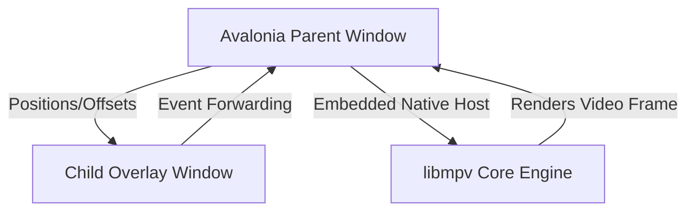

# BlueJay Player 🎬

BlueJay Player is a premium, enthusiast-grade media player built with **Avalonia UI (.NET 9)** and powered by the native **libmpv** playback engine. Designed with a custom Nocturne Deep Blue aesthetic, it offers high-performance video decoding, real-time diagnostic telemetry, and an interface tailored for audio/video purists.

---

## ✨ Core Features

### 📺 Playback & Video Engine
- **libmpv Integration**: Leverages raw P/Invoke bindings to the native `libmpv` library for hardware-accelerated video decoding.
- **Hardware Environment Profiles**: One-click toggles between **ECO**, **STANDARD**, and **ULTRA** rendering parameters.
- **Real-Time Telemetry & Mitigations**: Low-profile status badges dynamically display background auto-debanding (for streams under 2500 kbps) and Bob Weaver deinterlacing (`bwdif`).
- **Advanced Matrix Tuning**: Full dropdown control over `Scale`, `CScale`, and `Interpolation` algorithms.
- **Tone-Mapping Curves**: Support for `bt.2446a`, `mobius`, `reinhard`, `hable`, `spline`, and `linear` curves.
- **Display Calibration**: Target contrast and target peak brightness profiles optimized for standard displays and HDR/OLED monitors ("400 Nit OLED" and "1000 Nit Peak").

### 🎨 Design & Layout
- **Nocturne Deep Blue Theme**: Curated harmonious HSL palettes, smooth micro-animations, and glassmorphic overlay cards.
- **Sliding Panel Drawers**: Collapsible side drawers (Queue, Directory, and Engine) with transitions.
- **Dynamic Title Overlay**: Title block that fades in and displays video metadata on file load.
- **Seekbar Timeline**: Accurate seekbar containing visual chapter tick markers.

### 📁 Management & Playlists
- **Playlists Queue**: Drag-and-drop support for file additions, queue item deletion, list shuffling, and automatic next-up playback.
- **Directory Browser**: Interactive local folder navigation, sorting options, paginated item views, and formatted directory breadcrumbs (e.g., `DOWNLOADS ❯ VIDEOS`).

---

## ⌨️ Global Controls & Shortcuts

BlueJay Player handles input routing through a superior parent window filter. All custom hotkeys bypass and forward safely when system keys are active:

| Hotkey / Control | Action Description |
| :--- | :--- |
| `Space` | Toggle Play / Pause |
| `F` | Toggle Fullscreen Mode |
| `Escape` | Exit Fullscreen Mode |
| `Left Arrow` | Seek backward 5 seconds |
| `Right Arrow` | Seek forward 5 seconds |
| `Up Arrow` | Increase volume by 5% |
| `Down Arrow` | Decrease volume by 5% |
| `I` | Show Media Information Overlay |
| `Shift + I` | Toggle Sticky Telemetry Overlay |
| `Z` | Adjust subtitle delay (-0.1s delay) |
| `X` | Adjust subtitle delay (+0.1s delay) |
| `Win + Shift + Left/Right` | Snap whole player window to the next monitor |

---

## 🏗️ Architecture & Technology Stack



### 1. Focus & Input Redirection Layer
- **Dual-Window Sync**: Avalonia UI draws controls on a transparent, owned child window (`_overlayWindow`) overlayed atop the unmanaged rendering surface.
- **Snapping Synchronization**: Focus-redirection logic intercepts the `Win + Shift + Arrow` combinations at the parent level, triggers a programmatic display coordinates shift via the `Screens` API, and forwards window activation (`this.Activate()`) to keep the player frame locked together.
- **Focus Hijack Prevention**: All hover and navigation buttons are configured as non-focusable (`Focusable="False"`), ensuring the spacebar and arrows are reserved exclusively for timeline seeking and toggles.

### 2. User Settings Persistence
The application serializes settings locally to preserve configurations across sessions, including:
- Last active directory path.
- Loop and shuffle modes.
- Selected display brightness profile overrides (OLED/HDR).
- Advanced rendering configurations.

---

## 💻 Prerequisites & Setup Instructions

To configure the development environment and compile the player:

### 1. Install System Development Tools
* **.NET 9.0 SDK**: Download and install the latest [.NET 9.0 SDK](https://dotnet.microsoft.com/download/dotnet/9.0).
* **Git**: Install [Git](https://git-scm.com/) to clone the repository.
* **IDE**: Use Visual Studio 2022, JetBrains Rider, or VS Code (with the C# Dev Kit).

### 2. Clone the Repository
```bash
git clone https://github.com/Mr-Dav1d/BlueJay-Player.git
cd BlueJay-Player
```

### 3. Setup the Native Playback Engine (libmpv)
BlueJay Player targets the raw C API of `libmpv`:
1. Download the **64-bit `libmpv` shared library** from [mpv-winbuilds (shinchiro)](https://mpv.smarterplay.vip/) or the [SourceForge archive](https://sourceforge.net/projects/mpv-player-windows/files/libmpv/).
2. Create a folder named `Libs` in the root of your cloned repository (next to `BlueJayPlayer.csproj`).
3. Extract `mpv-2.dll` (or `libmpv.dll`), rename it to **`libmpv-2.dll`**, and place it directly inside:
   `BlueJay-Player/Libs/libmpv-2.dll`
4. *Note*: ffmpeg decoding libraries are statically compiled inside the `libmpv-2.dll` binary itself.

### 4. Build and Run
Compile the application via CLI:
```powershell
dotnet build
dotnet run
```

---

## 🚀 Releasing v1

To publish a standalone release bundle:

```powershell
dotnet publish -c Release -r win-x64 --self-contained true -p:PublishSingleFile=true
```

This compiles the player into a single executable folder, packing the .NET runtime, Avalonia assemblies, and dependencies. Ensure you copy `libmpv-2.dll` alongside the published executable for distribution.
